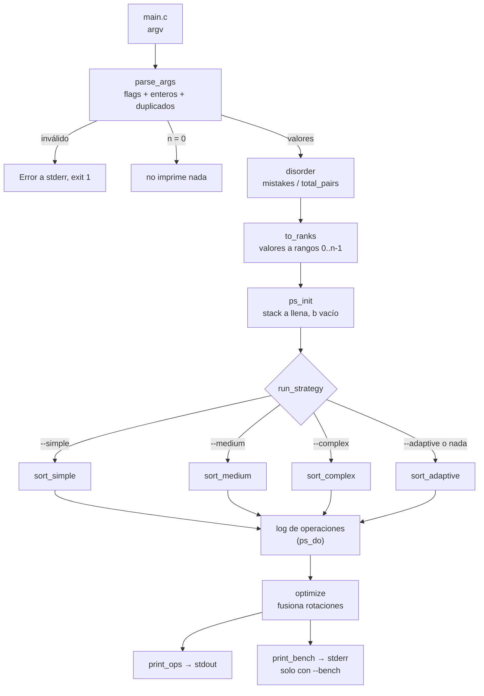
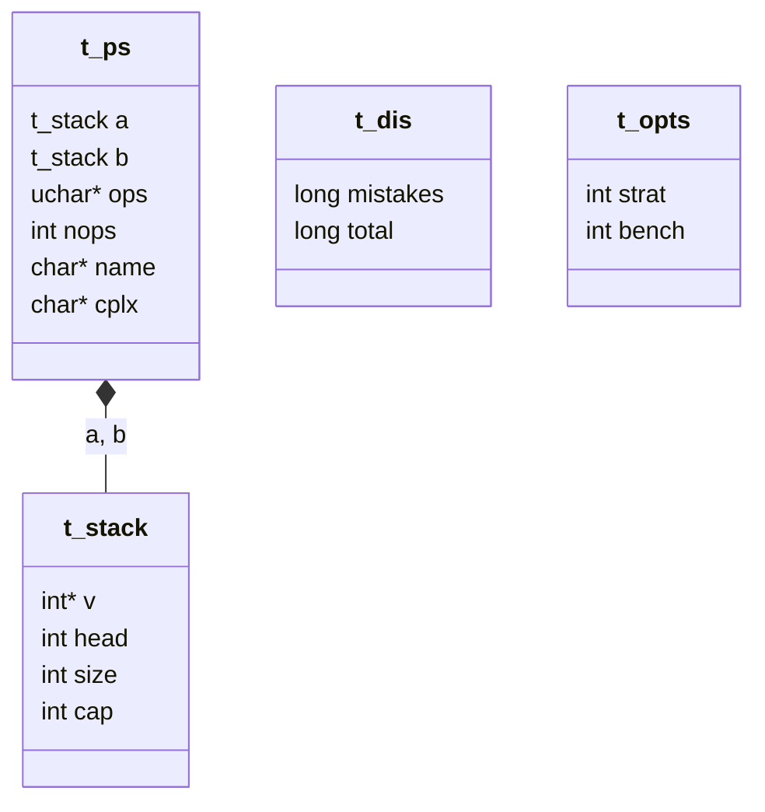
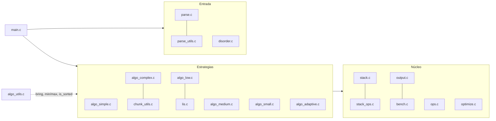
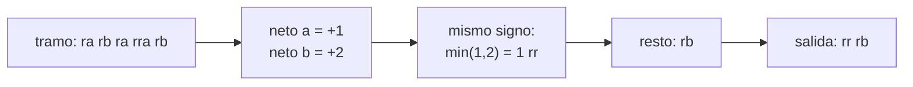
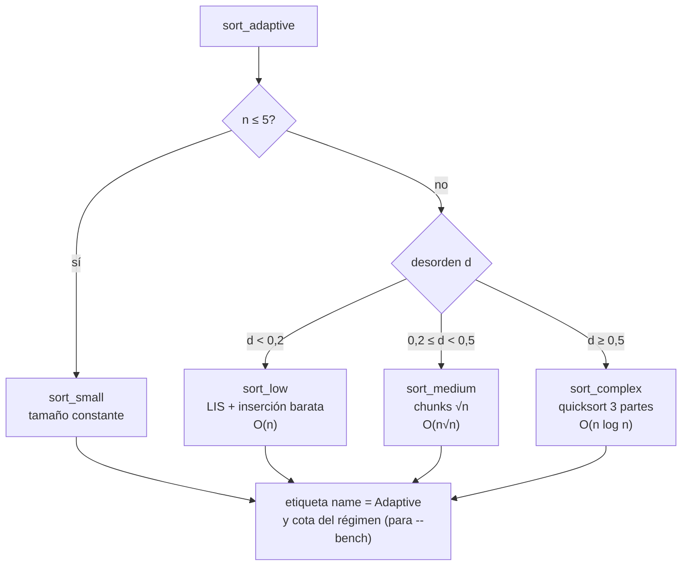
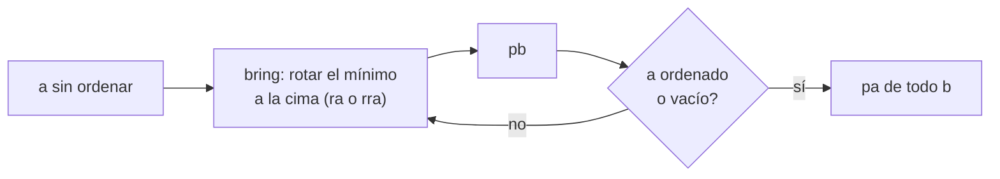
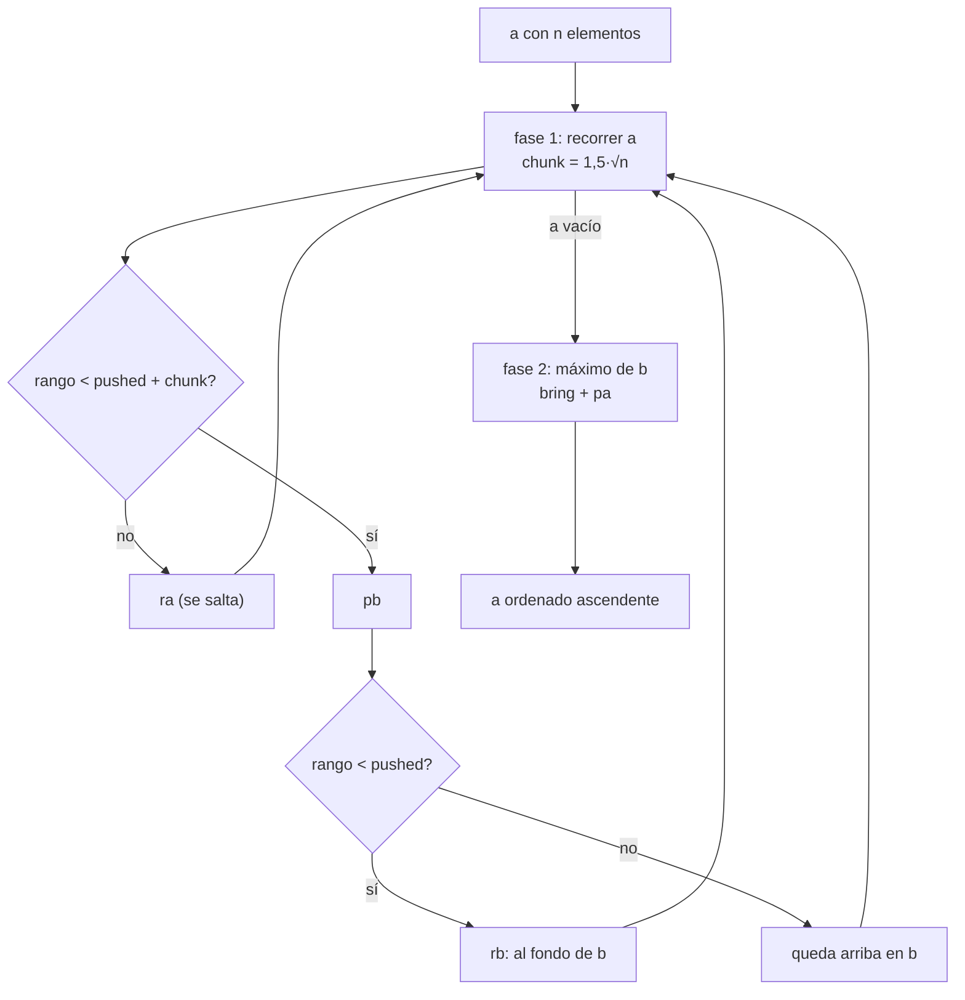
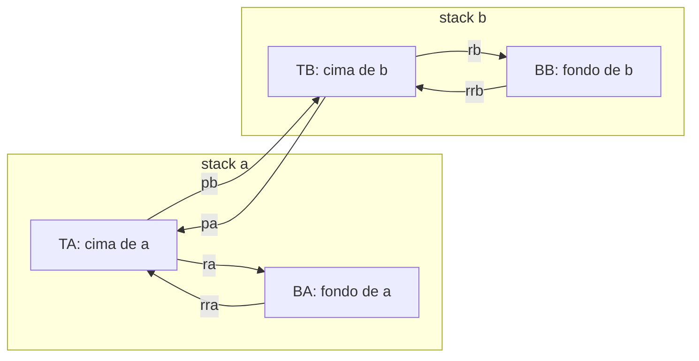
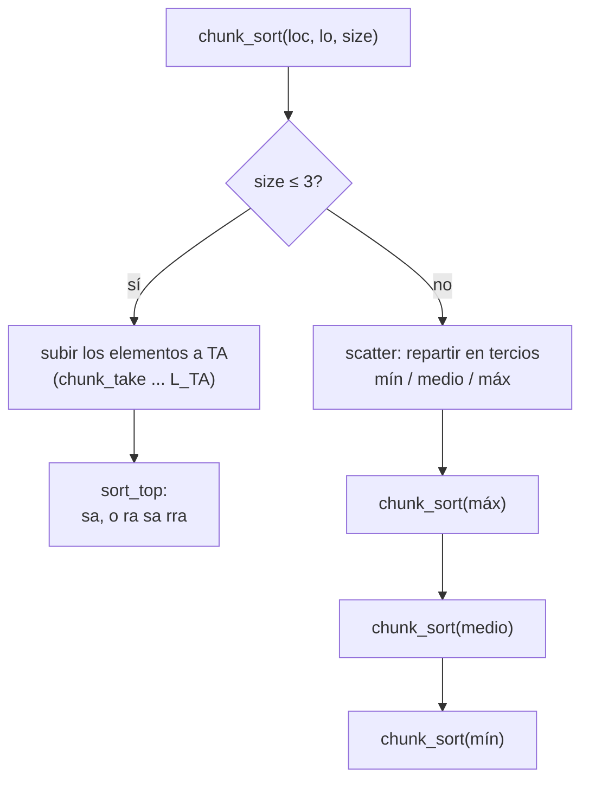
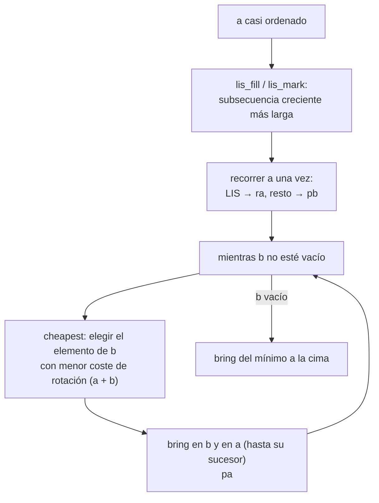

*Este proyecto ha sido creado como parte del currículo de 42 por jucortes, dcasasol.*

# push_swap

## Descripción

Ordena una lista de enteros usando dos stacks (`a` y `b`) y las 11 operaciones
de push_swap (`sa sb ss pa pb ra rb rr rra rrb rrr`). El programa escribe en
stdout la secuencia de operaciones; el objetivo es que sea lo más corta posible.

El binario incluye **cuatro estrategias** seleccionables por flag:

| Flag         | Estrategia                                   | Clase declarada |
|--------------|----------------------------------------------|-----------------|
| `--simple`   | Extracción del mínimo (selección)            | O(n²)           |
| `--medium`   | Chunks de tamaño ≈ 1,5√n                     | O(n√n)          |
| `--complex`  | Quicksort en 3 partes con 4 ubicaciones      | O(n log n)      |
| `--adaptive` | Elige según el índice de desorden (defecto)  | O(n) / O(n√n) / O(n log n) |

`--bench` imprime en **stderr** el desorden, la estrategia, el total de
operaciones y el desglose por tipo. El stdout solo lleva las operaciones.

Bonus: `checker`, que lee las operaciones de stdin y escribe `OK`/`KO`.

## Instrucciones

```sh
make            # compila push_swap (y libft)
make bonus      # compila checker
make clean / fclean / re

./push_swap 2 1 3 6 5 8
./push_swap --complex --bench $(shuf -i 0-9999 -n 500) > /dev/null
ARG="4 67 3 87 23"; ./push_swap $ARG | ./checker $ARG
```

Los argumentos pueden ir como enteros sueltos o en un solo string
(`"3 2 1"`). Errores (no enteros, fuera de rango `int`, duplicados, flag
desconocido o dos selectores de estrategia): `Error\n` en stderr y código 1.
Sin argumentos no se imprime nada.

## Cómo funciona el código

### Flujo general



Los algoritmos nunca escriben nada: llaman a `ps_do(p, OP)`, que **aplica** la
operación a los stacks y la **anota** en un log (`p->ops`). Solo al final se
optimiza el log y se imprime. Así la salida es siempre coherente con el estado
real de los stacks.

### Estructuras de datos



`t_stack` es un **buffer circular**: `head` apunta a la cima y el elemento `i`
está en `v[(head + i) % cap]`. Con eso, `pa`, `pb`, `ra`, `rra` solo mueven
`head` o `size` y cuestan O(1). Los valores se guardan como **rangos**
(`0..n-1`), por lo que los algoritmos comparan enteros pequeños y no dependen
de los números reales de la entrada.

### Mapa de ficheros



| Fichero | Responsabilidad |
|---------|-----------------|
| `parse.c`, `parse_utils.c` | Flags, validación de enteros (`int`), duplicados, argumentos con espacios |
| `disorder.c` | Índice de desorden y conversión a rangos |
| `stack.c`, `stack_ops.c` | Buffer circular: `push`, `pop`, `swap`, `rot`, `rrot` |
| `ops.c` | `ps_apply` (ejecuta una operación) y `ps_do` (ejecuta y anota) |
| `optimize.c` | Post-proceso del log de operaciones |
| `output.c`, `bench.c` | Salida de operaciones (stdout) y métricas (stderr) |
| `algo_utils.c` | `bring` (rotar por el camino más corto), mínimo/máximo, `is_sorted` |
| `algo_*.c`, `chunk_utils.c`, `lis.c` | Las estrategias |

### El optimizador

Los algoritmos generan rotaciones sueltas (`ra`, `rb`, `rra`...). `optimize()`
recorre el log y, para cada **tramo de rotaciones consecutivas** (sin `pa`,
`pb` ni `sa/sb` de por medio, que no conmutan con ellas), calcula la rotación
neta de `a` y de `b`:



Con eso se cancelan las rotaciones opuestas y se fusiona todo lo posible en
`rr`/`rrr`. El resultado nunca es más largo que la entrada, así que se puede
reescribir en el mismo buffer.

### Cómo decide `--adaptive`



Los umbrales se comparan con enteros (`mistakes * 5 < total` para 0,2 y
`mistakes * 2 < total` para 0,5), sin coma flotante.

### Simple (selección)



Como se extraen los mínimos en orden creciente, `b` queda con el mayor arriba;
los `pa` finales lo devuelven a `a` en orden ascendente.

### Medium (chunks)



En la fase 1 `b` se llena por bloques de rangos crecientes, con los más
pequeños de cada bloque hacia el fondo. Por eso en la fase 2 el máximo de `b`
siempre queda cerca de alguna de las dos puntas y `bring` lo alcanza con pocas
rotaciones.

### Complex (quicksort en 3 partes, 4 ubicaciones)

Un *chunk* es un bloque de rangos contiguos que vive en una de estas cuatro
ubicaciones (`L_TA`, `L_BA`, `L_TB`, `L_BB`):



Para ordenar un chunk (`chunk_sort`):



`scatter` mira el elemento accesible de la ubicación (`chunk_peek`), decide a
qué tercio pertenece y lo manda a la ubicación de destino con `chunk_take`. El
destino depende solo de la ubicación de origen y del tercio (`dest_of`):

| Origen | mín va a | medio va a | máx va a |
|--------|----------|------------|----------|
| `TA`   | `BB`     | `TB`       | `BA`     |
| `BA`   | `BB`     | `TB`       | `TA`     |
| `TB`   | `BB`     | `BA`       | `TA`     |
| `BB`   | `TB`     | `BA`       | `TA`     |

Se procesa siempre **máx → medio → mín**, así que la parte ya ordenada crece
hacia arriba en `a` (cada chunk terminado queda encima del anterior, con
valores menores). Cada elemento cuesta entre 1 y 3 operaciones por nivel y hay
⌈log₃ n⌉ niveles.

### Low (desorden bajo)



Los elementos de la LIS no se tocan; solo se mueven los que están fuera de
sitio (`k = n - |LIS|`), y cada uno se reinserta en `a` justo antes de su
sucesor.

## Diseño

Los valores se normalizan a **rangos** `0..n-1` (O(n²) una sola vez), así los
algoritmos no dependen del valor real. Cada stack es un buffer circular
(`t_stack`), de modo que `sa/pa/pb/ra/rra…` cuestan O(1). Los algoritmos
emiten operaciones a un log; al final `optimize()` normaliza cada tramo de
rotaciones consecutivas (`ra rb rra rrb`…): calcula la rotación neta de cada
stack, cancela las opuestas y fusiona lo posible en `rr`/`rrr`.

### Índice de desorden

`mistakes / total_pairs` sobre los pares `i<j` con `a[i] > a[j]`, calculado
antes de mover nada (O(n²) de CPU, no cuenta como operaciones push_swap).

### Simple — O(n²)

Mientras `a` no esté ordenado: rota el mínimo a la cima por el camino más
corto y lo pasa a `b`. Al final `pa` de todo (`b` queda descendente, `a`
ascendente). Cada extracción cuesta ≤ n/2 rotaciones → ≤ n²/4 + 2n ops.
Espacio extra O(n).

### Medium — O(n√n)

Fase 1: se recorre `a` y se pasan a `b` los elementos con rango
`< pushed + 1,5√n`; los que quedan por debajo de `pushed` se mandan al fondo con
`rb`. Hay ≈ √n/2 pasadas y cada una cuesta O(n) rotaciones → O(n√n).
Fase 2: se extrae siempre el máximo de `b` con la rotación más corta. Como `b`
está agrupado por chunks, el máximo queda a O(√n) de distancia → O(n√n) total.
Espacio O(n).

### Complex — O(n log n)

Quicksort recursivo en 3 partes sobre 4 ubicaciones: cima de `a`, fondo de
`a`, cima de `b` y fondo de `b`. Un *chunk* es un bloque de rangos contiguos en
una ubicación. Se reparte en mínimos / medios / máximos (tercios) y cada parte
va a una ubicación distinta según de dónde venga (tabla en `dest_of`), con
1-3 operaciones por elemento (`ra`, `rra`, `pb`, `pa`, `rb`, `rrb`).
Se procesan primero los máximos, luego los medios y luego los mínimos, de modo
que la parte ya ordenada crece hacia arriba en `a`. Un chunk de ≤ 3 elementos
se sube a la cima de `a` y se ordena con `sa` (y `ra sa rra`).
Cada nivel cuesta O(n) operaciones y hay ⌈log₃ n⌉ niveles → O(n log n).
Espacio extra O(n) (recursión O(log n)).

### Adaptive

| Desorden `d`      | Método interno                          | Cota |
|-------------------|-----------------------------------------|------|
| `d < 0,2`         | LIS + inserción de los restantes (Low)  | O(n) con pocos desordenados |
| `0,2 ≤ d < 0,5`   | Medium (chunks)                         | O(n√n) |
| `d ≥ 0,5`         | Complex (quicksort 3 partes)            | O(n log n) |

Además, con n ≤ 5 se usa un ordenador de tamaño constante (≤ 2 extracciones
de mínimo + 3 elementos a mano), O(1).

**Umbrales.** 0,2 / 0,5 los fija el enunciado. Una permutación aleatoria tiene
desorden esperado 0,5, así que el caso peor queda en el método de cota
n log n, que no depende del orden inicial. Por debajo de 0,5 los datos ya traen
estructura que un chunk aprovecha (menos rotaciones en la fase 2), y por
debajo de 0,2 se explota todavía más: el orden ya existente.

**Low (d < 0,2).** Se calcula una subsecuencia creciente más larga (LIS) de
`a` (DP O(n²) de CPU). Se recorre `a` una vez: los elementos de la LIS se
saltan con `ra`, el resto (k = n − |LIS|) va a `b` con `pb`. Después se
reinserta el elemento de `b` **más barato** (rotación de `b` + rotación de `a`
hasta su sucesor) con `pa`. Coste ≈ n + k·O(n): lineal cuando k es constante o
pequeño respecto a n (entrada casi ordenada). Con d cercano a 0,2 k crece y el
coste real se acerca a O(n·k); es el compromiso asumido para esta zona.

### Rendimiento medido (aleatorio, 100 ejecuciones)

| n   | simple | medium | complex (media / máx) | adaptive (máx) |
|-----|--------|--------|-----------------------|----------------|
| 100 | ~1420  | ~555   | ~670 / 692            | < 700          |
| 500 | ~32100 | ~4900  | ~4450 / 4483          | < 5500         |

Con `--adaptive` un input aleatorio cae a ambos lados de 0,5 y usa medium o
complex; ambos quedan en "excelente" (< 700 / < 5500).

## Contribuciones

- **jucortes**: parser y validación, stacks/operaciones, optimizador de
  rotaciones, estrategias simple/medium/complex/adaptive, checker (bonus),
  Makefile.
- **dcasasol**: <!-- completar -->

## Recursos

- Enunciado de 42 push_swap.
- Wikipedia: *Selection sort*, *Quicksort*, *Longest increasing subsequence*.
- Artículos y notas de la comunidad 42 sobre chunk sort y quicksort sobre stacks.

**Uso de IA.** Se usó Claude (Claude Code) como asistente para: portar a C los
prototipos Python de validación de los algoritmos, escribir el código de
`src/` y `bonus/`, adaptarlo a la norma, escribir los tests de verificación y
redactar este README. El equipo debe revisar y entender todo el código antes de entregarlo.
